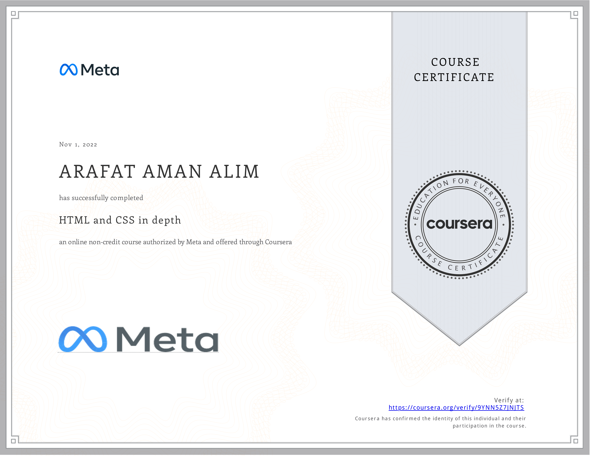

# Meta Front-End Developer Professional Certificate

- This directory contains all of my assignments from the Coursera Course: [HTML and CSS in Depth](https://www.coursera.org/learn/html-and-css-in-depth)

## Table of Content

### Course 2: [Programming with JavaScript](https://github.com/ginny100/Meta-Front-End-Developer/tree/master/Course%202%20-%20Programming%20with%20JavaScript)

- Week 1: [HTML in depth](https://github.com/ginny100/Meta-Front-End-Developer/tree/master/Course%204%20-%20HTML%20and%20CSS%20in%20depth/Week%201%20-%20HTML%20in%20depth)
- Week 2: [Interactive CSS](https://github.com/ginny100/Meta-Front-End-Developer/tree/master/Course%204%20-%20HTML%20and%20CSS%20in%20depth/Week%202%20-%20Interactive%20CSS)
- Week 3: [Graded Assessment](https://github.com/ginny100/Meta-Front-End-Developer/tree/master/Course%204%20-%20HTML%20and%20CSS%20in%20depth/Week%203%20-%20Graded%20Assessment)

## Proof of Completion

